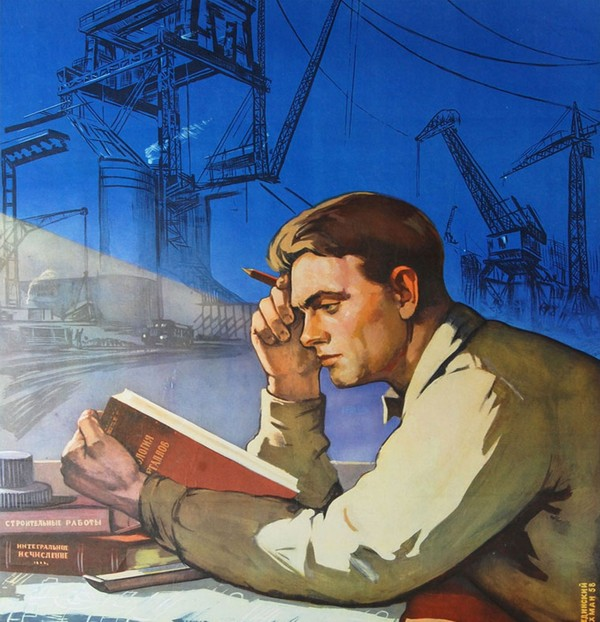

# Советское наследие: математика

-----

> [!NOTE]
> Прежде чем с головой окунуться в чтение книг, ознакомьтесь с [небольшим обзором](../../2025/2025-06-10-pdf-readers) на программы-читалки, которые помогут сделать процесс комфортным и безопасным для зрения.
> 
> Тут много ссылок для скачивания файлов. Если вы не умеете работать с гитхабом, вам поможет [специальный гайд](../../2025/2025-06-11-how-to-download-files).
>
> Из-за ограничений гитхаба на размер единичного файла часть книг упакована в многотомные архивы с помощью архиватора `7-Zip`. Свежую версию можно найти на [официальном сайте](https://www.7-zip.org/download.html) или в [репозитории разработчика](https://github.com/ip7z/7zip/releases).

> [!TIP]
> Рекомендую также предварительно изучить книгу **Сергея Иннокентьевича Поварнина** «[Как читать книги для самообразования](../../../../../../data-01/blob/main/2025-06-08-math-for-beginners/files/povarnin_reading_books.7z)».

## Советская литература по математике

[[скачать]](../../../../../../math-01/blob/main/zeldovich_yaglom_1982.7z) Зельдович Я. Б., Яглом И. М. *Высшая математика для начинающих физиков и техников*. М.: Наука, 1982. 512 с.

